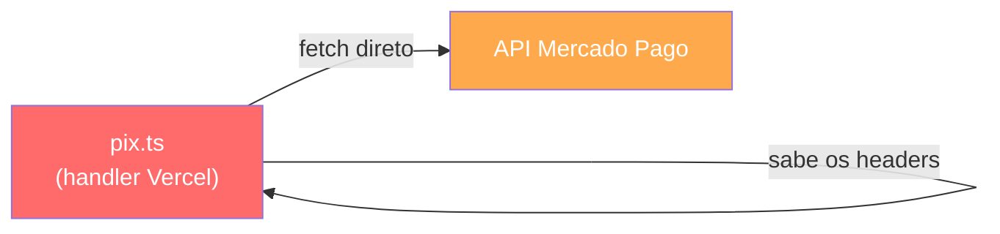
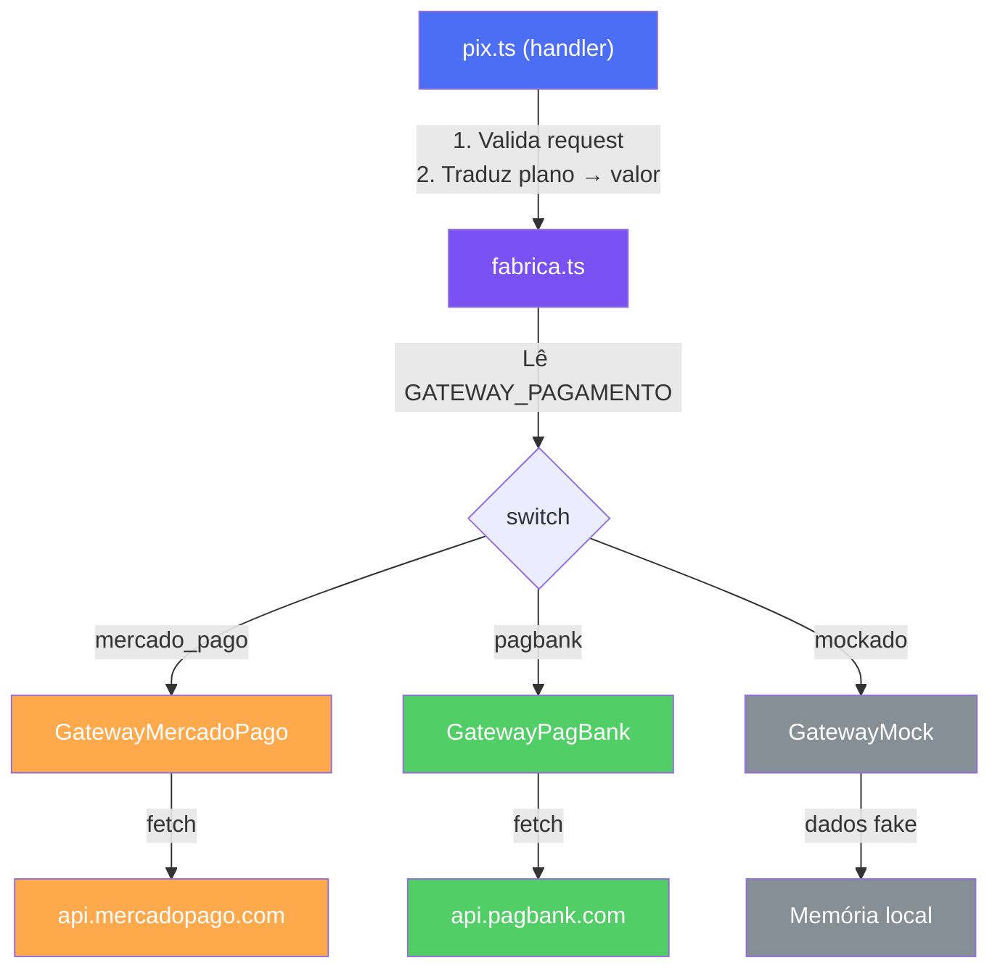
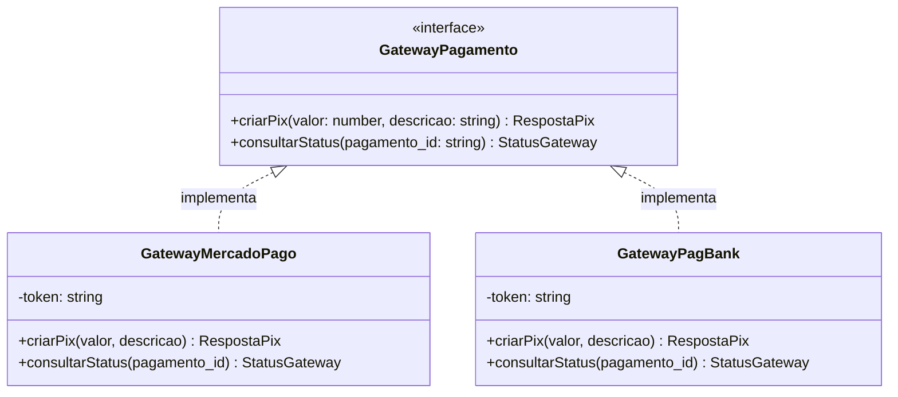

# Strategy Pattern no Backend — Explicação Visual

## O que você acertou ✅

1. **Criou uma interface** [ProvedorPagamento](./services/pagamento/tipos.ts#12-16) com métodos — isso É o Strategy Pattern
2. **Definiu [GatewayPagamento](./api/_lib/gateways/tipos.ts#3-4)** como tipo literal — correto
3. **Pensou em 3 métodos** que refletem os 3 arquivos ([pix.ts](./api/pagamentos/pix.ts), [status.ts](./api/pagamentos/status.ts), [confirmar.ts](./api/pagamentos/confirmar.ts)) — a intuição está certa
4. **Reutilizou [PlanoID](./api/_lib/gateways/tipos.ts#9-10)** — correto

## O que precisa de ajuste 🔧

### Problema 1: A interface do gateway deve receber dados genéricos, não IDs de plano

O gateway **não sabe** o que é um "plano_cafe". Ele só sabe: "me deram um valor em reais e uma descrição, e eu crio um PIX".

Quem traduz plano → valor é o **handler** ([pix.ts](./api/pagamentos/pix.ts)), que já tem a `TABELA_PRECOS`. O gateway é burro de propósito — ele só fala com a API externa.

### Problema 2: [confirmarPagamento](./api/_lib/gateways/tipos.ts#14-15) não pertence ao gateway

Confirmar pagamento = gerar token + salvar no banco. Isso é **lógica de negócio**, não lógica de gateway. O gateway só sabe verificar "esse pagamento foi aprovado?", que é o [consultarStatus](./services/pagamento/tipos.ts#14-15).

### Problema 3: [RespostaGatewayPagamento](./api/_lib/gateways/tipos.ts#5-8) precisa ter os dados do PIX

A resposta precisa conter: ID do pagamento, QR code (base64), código copia-e-cola, e status. Não só o nome do gateway.

---

## Visualizando o Fluxo

### ANTES (tudo misturado no handler):

> O handler faz TUDO: valida request, monta payload, sabe a URL, faz fetch, parseia resposta. É engenheiro, pedreiro e eletricista ao mesmo tempo.

### DEPOIS (responsabilidades separadas):

> Cada um faz UMA coisa. O handler valida. A fábrica escolhe. O gateway conversa com a API.

---

## Quem faz o quê?

| Responsabilidade | Quem faz | Arquivo |
|---|---|---|
| Validar se o request é POST | **Handler** | [pix.ts](./api/pagamentos/pix.ts) |
| Traduzir `plano_cafe` → R$ 2,90 | **Handler** | [pix.ts](./api/pagamentos/pix.ts) |
| Escolher qual gateway usar | **Fábrica** | `_lib/gateways/fabrica.ts` |
| Saber a URL da API do Mercado Pago | **Gateway MP** | `_lib/gateways/mercado-pago.ts` |
| Saber a URL da API do PagBank | **Gateway PagBank** | `_lib/gateways/pagbank.ts` |
| Montar o payload correto | **Gateway** | Cada um o seu |
| Parsear a resposta da API | **Gateway** | Cada um o seu |

---

## A Interface Correta

O gateway backend precisa de **2 métodos** (não 3):

### Por que 2 métodos e não 3?

- **[criarPix(valor, descricao)](file:///c:/Users/LKSFERREIRA/Documents/GitHub/sem-susto/api/_lib/gateways/tipos.ts#12-13)** → usado pelo [pix.ts](file:///c:/Users/LKSFERREIRA/Documents/GitHub/sem-susto/api/pagamentos/pix.ts)
- **[consultarStatus(pagamento_id)](file:///c:/Users/LKSFERREIRA/Documents/GitHub/sem-susto/services/pagamento/tipos.ts#14-15)** → usado pelo [status.ts](file:///c:/Users/LKSFERREIRA/Documents/GitHub/sem-susto/api/pagamentos/status.ts) **E** pelo [confirmar.ts](file:///c:/Users/LKSFERREIRA/Documents/GitHub/sem-susto/api/pagamentos/confirmar.ts)

O [confirmar.ts](file:///c:/Users/LKSFERREIRA/Documents/GitHub/sem-susto/api/pagamentos/confirmar.ts) consulta o status (usando [consultarStatus](file:///c:/Users/LKSFERREIRA/Documents/GitHub/sem-susto/services/pagamento/tipos.ts#14-15)) e depois gera o token. A geração de token não é responsabilidade do gateway — é lógica de negócio do app.

### O que cada método recebe e retorna:

**[criarPix](file:///c:/Users/LKSFERREIRA/Documents/GitHub/sem-susto/api/_lib/gateways/tipos.ts#12-13)** recebe dados genéricos:
- `valor`: number (ex: 2.90)
- `descricao`: string (ex: "Plano Café - 15 dias")

Retorna dados genéricos:
- `id`: string
- `qr_code`: string
- `qr_code_base64`: string
- `status`: string

**[consultarStatus](file:///c:/Users/LKSFERREIRA/Documents/GitHub/sem-susto/services/pagamento/tipos.ts#14-15)** recebe:
- `pagamento_id`: string

Retorna:
- `status`: string (o status original da API, como `'approved'` ou `'PAID'`)

> [!IMPORTANT]
> O gateway retorna o status **cru** da API (ex: `'approved'`, `'PAID'`). Quem traduz para `'aprovado'`/`'pendente'` é o **handler**, não o gateway. Cada API tem status diferentes, mas o handler normaliza.
