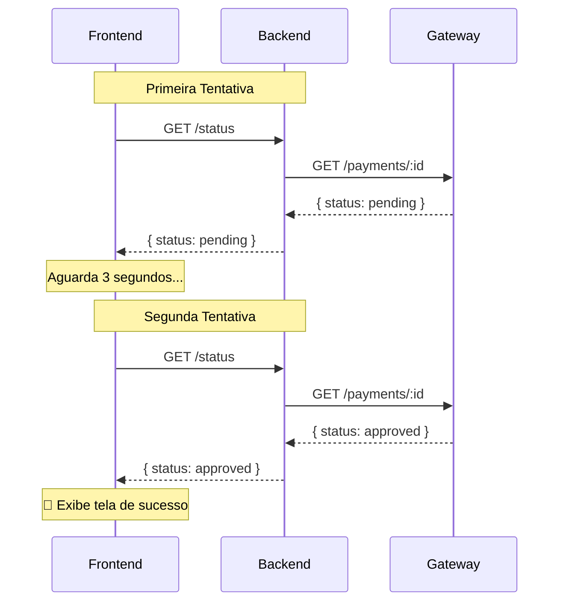
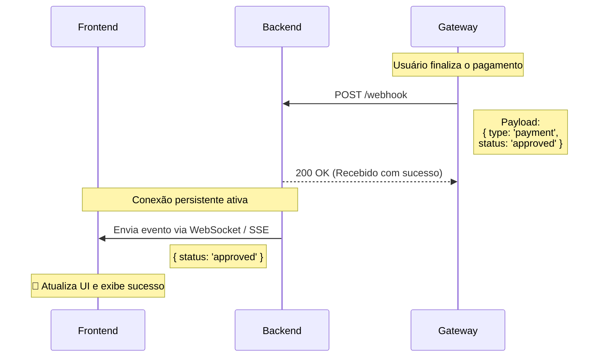

# Integração com Gateways de Pagamento — Guia Conceitual

> **Propósito:** Este documento não é um tutorial de código. É um guia de **conceitos fundamentais** que permitem integrar qualquer gateway de pagamento (Mercado Pago, Stripe, PagSeguro, PayPal, Adyen...) em qualquer linguagem ou framework.
>
> **Filosofia:** Se você entende os conceitos, trocar de gateway é trocar de SDK — não é reaprender tudo.

---

## 1. Os 5 Atores do Fluxo

Todo pagamento online envolve 5 participantes. Não importa se é PIX, cartão de crédito ou boleto — os atores são os mesmos:

```
┌─────────────┐      ┌─────────────┐      ┌─────────────┐      ┌─────────────┐      ┌─────────────┐
│   USUÁRIO   │───>  │  FRONTEND   │───>  │  BACKEND    │───>  │   GATEWAY   │───>  │    BANCO    │
│  (Pagador)  │      │  (Browser)  │      │ (Servidor)  │      │ (MP/Stripe) │      │  (Itaú,BB)  │
└─────────────┘      └─────────────┘      └─────────────┘      └─────────────┘      └─────────────┘
```

| Ator         | O que faz                                            | Exemplo               |
| ------------ | ---------------------------------------------------- | --------------------- |
| **Usuário**  | Decide pagar, escaneia QR, digita cartão             | Pessoa no celular     |
| **Frontend** | Exibe interface, coleta dados, mostra feedback       | React, Flutter, HTML  |
| **Backend**  | Cria pagamento, guarda segredos, valida resposta     | Node.js, Python, Java |
| **Gateway**  | Processa pagamento, fala com o banco, retorna status | Mercado Pago, Stripe  |
| **Banco**    | Efetua a transferência real do dinheiro              | Itaú, Nubank, BB      |

### Regra de Ouro #1

> **O frontend NUNCA fala diretamente com o gateway.** Sempre passa pelo backend. Motivo: as chaves de API do gateway são secretas. Expor no browser = qualquer pessoa pode criar pagamentos no seu nome.

---

## 2. O Ciclo de Vida de um Pagamento

Todo pagamento, em todo gateway, segue **exatamente** este ciclo:

```
 [INEXISTENTE]
      │
      ▼  (Backend cria pagamento via API)
 [CRIADO / PENDENTE]
      │
      ├──▶ Usuário paga ──▶ [APROVADO] ✅
      │
      ├──▶ Tempo esgota ──▶ [EXPIRADO] ⏰
      │
      └──▶ Banco recusa ──▶ [RECUSADO / FALHA] ❌
```

### Nomenclatura por Gateway

| Status   | Mercado Pago | Stripe                    | PagSeguro         |
| -------- | ------------ | ------------------------- | ----------------- |
| Pendente | `pending`    | `requires_payment_method` | `WAITING_PAYMENT` |
| Aprovado | `approved`   | `succeeded`               | `PAID`            |
| Recusado | `rejected`   | `failed`                  | `DECLINED`        |
| Expirado | `cancelled`  | `expired`                 | `EXPIRED`         |

**Conceito-chave:** Você NUNCA vai inventar um status. O gateway te diz o status. Seu trabalho é **mapear** os status do gateway para os status internos do seu sistema.

---

## 3. As 3 Fases da Integração

### Fase 1 — Criação do Pagamento (Backend → Gateway)

O backend envia para o gateway:

- **Quanto** cobrar (valor em centavos ou reais, depende do gateway)
- **Como** cobrar (PIX, cartão, boleto)
- **Quem** está pagando (e-mail mínimo, por compliance)
- **Chave de idempotência** (evita cobrar duas vezes se a rede falhar)

O gateway responde com:

- **ID do pagamento** (identificador único para rastrear)
- **Dados de apresentação** (QR Code, link de pagamento, formulário de cartão)
- **Status inicial** (sempre `pendente`)

```
POST /v1/payments (Mercado Pago)
POST /v1/payment_intents (Stripe)
POST /v2/checkout/preferences (PagSeguro)
```

> **Conceito: Idempotência.** Se sua rede cair e o frontend reenviar o pedido de criação, o gateway usa o `idempotency_key` para retornar o MESMO pagamento já criado, em vez de criar outro. Isso evita cobranças duplicadas. **Sempre envie uma chave de idempotência.**

### Fase 2 — Apresentação ao Usuário (Backend → Frontend → Usuário)

O backend devolve os dados ao frontend, que exibe para o usuário:

| Método               | O que é exibido                                      | Como o usuário paga                 |
| -------------------- | ---------------------------------------------------- | ----------------------------------- |
| **PIX**              | QR Code + código copia-e-cola                        | Abre app do banco, escaneia ou cola |
| **Cartão**           | Formulário tokenizado (Stripe Elements, MP CardForm) | Digita número, validade, CVV        |
| **Boleto**           | PDF + código de barras                               | Paga no app do banco ou lotérica    |
| **Checkout Externo** | Redirect URL                                         | Usuário é levado ao site do gateway |

> **Conceito: Token de Cartão.** Você NUNCA recebe o número do cartão no seu backend. O frontend usa uma biblioteca do gateway (Stripe.js, MercadoPago.js) que tokeniza o cartão diretamente servers do gateway e te retorna um `token_id`. Você envia esse `token_id` ao seu backend, que envia ao gateway. Isso é exigido pelo PCI-DSS (norma mundial de segurança de cartões).

### Fase 3 — Confirmação do Pagamento (Gateway → Backend)

Existem **duas estratégias** para saber se o pagamento foi aprovado. Essa é a decisão arquitetural mais importante da integração:

---

## 4. Polling vs Webhook — As Duas Estratégias de Confirmação

### Estratégia A: Polling ("Eu fico perguntando")


```
Frontend                          Backend                           Gateway
   |                                 |                                 |
   | ──── [1] GET /status ─────────> |                                 |
   |                                 | ──── [2] GET /payments/id ────> |
   |                                 | <---- [3] status: pending ----- |
   | <---- [4] status: pending ----- |                                 |
   |                                 |                                 |
   |          (aguarda 3s)           |                                 |
   |                                 |                                 |
   | ──── [5] GET /status ─────────> |                                 |
   |                                 | ──── [6] GET /payments/id ────> |
   |                                 | <---- [7] status: approved ---- |
   | <---- [8] status: approved ---- |                                 |
   |                                 |                                 |
   | Exibe sucesso                   |                                 |
   |                                 |                                 |
Frontend                          Backend                           Gateway
```

**Como funciona:** O frontend pergunta ao backend "já pagou?" a cada N segundos. O backend repassa a pergunta ao gateway.

| Prós                           | Contras                                      |
| ------------------------------ | -------------------------------------------- |
| ✅ Simples de implementar      | ❌ Gasta requisições (custo de API)          |
| ✅ Funciona em qualquer infra  | ❌ Delay de até N segundos para detectar     |
| ✅ Não precisa de URL pública  | ❌ Não escala para milhares de pagamentos    |
| ✅ Não precisa de HTTPS no dev | ❌ Se o usuário fechar a aba, perde o status |

**Quando usar:** MVP, apps com poucos pagamentos/dia, protótipos, quando você não tem servidor 24/7.

### Estratégia B: Webhook ("O gateway me avisa")



```
Frontend                          Backend                           Gateway
   |                                 |                                 |
   |                                 |         (Usuário pagou)         |
   |                                 | <---- POST /webhook ----------- |
   |                                 |       { type: payment,          |
   |                                 |         status: approved }      |
   |                                 |                                 |
   |                                 |                                 |
   |                                 | ──── 200 OK ──────────────────> |
   |                                 |                                 |
   | <---- (WebSocket/SSE) --------- |                                 |
   |                                 |                                 |
   | Exibe sucesso                   |                                 |
   |                                 |                                 |
Frontend                          Backend                           Gateway
```

**Como funciona:** Você registra uma URL no painel do gateway ("quando houver mudança de status, mande um POST para essa URL"). O gateway te avisa automaticamente.

| Prós                                     | Contras                                   |
| ---------------------------------------- | ----------------------------------------- |
| ✅ Instantâneo (< 1 segundo)             | ❌ Precisa de URL pública acessível       |
| ✅ Não gasta requisições                 | ❌ Precisa de HTTPS (certificado SSL)     |
| ✅ Funciona mesmo se o user fechar o app | ❌ Precisa validar assinatura (segurança) |
| ✅ Escala para milhões de pagamentos     | ❌ Mais complexo de implementar e testar  |

**Quando usar:** Produção séria, SaaS, e-commerce, qualquer app com volume de pagamentos.

### Conceito Crítico: Validação do Webhook

Webhooks são **perigosos** se não validados. Qualquer pessoa pode enviar um POST para sua URL fingindo ser o gateway. Por isso:

1. **Assinatura criptográfica:** O gateway assina o payload com uma chave secreta. Você valida usando HMAC-SHA256 (Stripe) ou verificando o `x-signature` (Mercado Pago).
2. **IP Allowlist:** Aceite webhooks apenas de IPs do gateway (lista na documentação deles).
3. **Verificação dupla:** Após receber o webhook, faça uma chamada GET ao gateway para confirmar o status. Nunca confie cegamente no payload do webhook.

```
# Pseudocódigo universal de webhook:

receber_webhook(request):
    # 1. Validar assinatura
    if not validar_assinatura(request.headers, request.body, WEBHOOK_SECRET):
        return 401 "Assinatura inválida"

    # 2. Extrair dados
    pagamento_id = request.body.payment_id
    status_informado = request.body.status

    # 3. Verificação dupla (NUNCA confie cegamente)
    status_real = gateway.consultar_pagamento(pagamento_id)

    if status_real != "approved":
        return 200  # Responde OK mas não faz nada

    # 4. Executar ação de negócio (gerar licença, liberar acesso, etc)
    gerar_token_premium(pagamento_id)

    return 200 "OK"
```

### Estratégia Híbrida (O que o Sem Susto usa)

```
Polling no frontend (UX de "aguardando aprovação")
         +
Verificação server-side no backend (segurança)
```

O polling garante feedback visual em tempo real. A verificação server-side garante que ninguém forje um pagamento aprovado. Quando migrar para Supabase, o plano é adicionar webhook via Edge Functions para eliminar o polling.

---

## 5. Segurança — Os 6 Mandamentos

### 5.1 Chaves de API

Todo gateway fornece **dois pares** de chaves:

| Chave                            | Onde usar | Exposta no browser?                                  |
| -------------------------------- | --------- | ---------------------------------------------------- |
| **Public Key** (Publishable Key) | Frontend  | ✅ Sim (é segura, só permite ações limitadas)        |
| **Secret Key** (Access Token)    | Backend   | ❌ NUNCA (permite criar pagamentos, reembolsar, etc) |

> **Se vazar a Secret Key:** Qualquer pessoa pode criar cobranças, emitir reembolsos e acessar dados financeiros da sua conta. Revogue imediatamente no painel do gateway.

### 5.2 Validação Server-Side de Valor

**NUNCA** confie no valor que o frontend envia. O usuário pode inspecionar o HTML e mudar "R$ 9,90" para "R$ 0,01".

```
# ERRADO — confia no frontend
criar_pagamento(valor: request.body.valor)

# CORRETO — backend tem a tabela de preços
TABELA_PRECOS = { cafe: 2.90, lanche: 4.90, apoiador: 9.90 }
valor_real = TABELA_PRECOS[request.body.plano_id]
criar_pagamento(valor: valor_real)
```

### 5.3 Idempotência

Se a rede cair entre "pagamento aprovado" e "token gerado", o frontend pode reenviar a requisição. Sem idempotência, você geraria dois tokens para um pagamento.

```
# Solução: Vincular pagamento_id ao token no banco
# Se já existe token para esse pagamento_id → retorna o existente
# Constraint UNIQUE no banco garante atomicidade
```

### 5.4 CORS

Suas APIs de pagamento precisam de CORS restritivo. Só aceite requests de domínios que você controla:

```
Access-Control-Allow-Origin: https://www.seuapp.com
```

Nunca use `*` em produção para endpoints financeiros.

### 5.5 Rate Limiting

Proteja endpoints de pagamento contra abuso:

- Máximo de X tentativas por IP por hora
- Bloqueio temporário após Y falhas consecutivas
- Logue todas as tentativas para análise

### 5.6 Logs e Auditoria

Registre **tudo** sobre pagamentos:

- Quem pagou (hash, não dados pessoais)
- Quando
- Quanto
- Status de cada mudança
- IP de origem (hash para LGPD)

Isso é obrigatório por compliance financeiro e invaluável para disputas.

---

## 6. Anatomia de uma Integração PIX (Passo a Passo)

PIX é o método mais moderno e mais simples de integrar. Aqui está o fluxo completo, conceito por conceito:

### Passo 1 — Usuário clica "Pagar com PIX"

O frontend sabe qual plano o usuário escolheu (ex: `plano_lanche`). Envia para o **seu** backend.

### Passo 2 — Backend cria o pagamento no gateway

```
POST gateway.com/v1/payments
{
  "transaction_amount": 4.90,       ← valor da tabela SERVER-SIDE
  "payment_method_id": "pix",       ← método escolhido
  "payer": { "email": "anon@..." }, ← mínimo exigido por compliance
  "idempotency_key": "unique-123"   ← anti-duplicação
}
```

### Passo 3 — Gateway responde com dados do PIX

```json
{
  "id": "PAY_123456", // ID do pagamento
  "status": "pending", // Sempre pendente inicialmente
  "point_of_interaction": {
    "transaction_data": {
      "qr_code": "00020101021226...", // Texto do PIX Copia e Cola
      "qr_code_base64": "iVBORw0KGgo..." // Imagem PNG do QR Code
    }
  }
}
```

### Passo 4 — Backend retorna dados ao frontend

O backend filtra e retorna apenas o que o frontend precisa: `pagamento_id`, `qr_code`, `qr_code_base64`.

**Nunca** repasse a resposta inteira do gateway ao frontend — ela pode conter dados sensíveis.

### Passo 5 — Frontend exibe QR Code

Renderiza a imagem base64 como `` e o código copia-e-cola como texto copiável.

### Passo 6 — Usuário escaneia e paga

O app do banco do usuário lê o QR, exibe o valor, usuário confirma. Isso acontece **fora do seu app**.

### Passo 7 — Detecção da aprovação

**Via Polling:** Frontend pergunta ao backend a cada 2-5 segundos:

```
GET /api/pagamentos/status?id=PAY_123456
   → Backend consulta → GET gateway.com/v1/payments/PAY_123456
   → Retorna { status: "approved" } quando confirmado
```

**Via Webhook:** O gateway envia POST para sua URL cadastrada automaticamente.

### Passo 8 — Ação pós-pagamento

Backend verifica o status **server-side** (nunca confie no frontend), executa a ação de negócio (gerar token, liberar acesso, enviar e-mail) e retorna confirmação ao frontend.

### Passo 9 — Frontend exibe sucesso

Modal de aprovação, animação, confete, som — qualquer feedback de dopamina que confirme ao usuário que deu certo.

---

## 7. Diferenças Práticas Entre Gateways

### Mercado Pago

| Aspecto        | Detalhe                                            |
| -------------- | -------------------------------------------------- |
| **PIX**        | QR Code gerado via API REST                        |
| **Auth**       | Bearer Token (`MP_ACCESS_TOKEN`)                   |
| **Webhook**    | Configurável no painel, valida via `x-signature`   |
| **SDK**        | Tem SDK oficial, mas funciona bem com `fetch` puro |
| **Ideal para** | América Latina, apps brasileiros                   |

### Stripe

| Aspecto        | Detalhe                                              |
| -------------- | ---------------------------------------------------- |
| **PIX**        | Suporta desde 2022 (via PaymentIntents)              |
| **Auth**       | API Key no header (`Authorization: Bearer sk_...`)   |
| **Webhook**    | Assinatura HMAC-SHA256 via `stripe-signature` header |
| **SDK**        | `stripe` (Node.js), `stripe-python`, etc.            |
| **Ideal para** | Apps globais, SaaS, marketplace                      |

### Conceito Universal

Apesar das diferenças de naming e SDK, **todos seguem o mesmo padrão:**

1. Cria pagamento (POST)
2. Presenta ao usuário (QR/formulário/redirect)
3. Detecta aprovação (polling ou webhook)
4. Executa ação de negócio
5. Confirma ao usuário

Se você entende esses 5 passos, trocar de Mercado Pago para Stripe é **ler documentação**, não reaprender conceitos.

---

## 8. Ambientes: Sandbox vs Produção

Todo gateway sério oferece dois ambientes:

| Ambiente            | Chaves                      | Dinheiro real? | Uso                      |
| ------------------- | --------------------------- | -------------- | ------------------------ |
| **Sandbox / Test**  | `TEST_...` ou `sk_test_...` | ❌ Simulado    | Desenvolvimento e testes |
| **Produção / Live** | `LIVE_...` ou `sk_live_...` | ✅ Real        | App em produção          |

**Dica profissional:** Crie um **provedor mock** no seu código que simula o comportamento do gateway sem nenhuma chamada de rede. Isso permite:

- Testar sem internet
- Simular cenários de erro (timeout, recusa, expiração)
- Rodar testes automatizados em CI/CD
- Desenvolver o frontend sem depender do backend estar online

---

## 9. Glossário Rápido

| Termo               | Significado                                                         |
| ------------------- | ------------------------------------------------------------------- |
| **Gateway**         | Intermediário entre você e o banco (Stripe, MP, PayPal)             |
| **Checkout**        | Tela/modal onde o usuário efetua o pagamento                        |
| **Payment Intent**  | Objeto que representa a "intenção de pagamento" (Stripe)            |
| **Idempotency Key** | Chave que impede cobranças duplicadas se houver retry               |
| **Webhook**         | URL que o gateway chama quando o status muda                        |
| **Polling**         | Frontend perguntando "já pagou?" repetidamente                      |
| **PCI-DSS**         | Norma de segurança para dados de cartão de crédito                  |
| **Tokenização**     | Substituir número do cartão por um token temporário seguro          |
| **Provedor Mock**   | Classe que simula o gateway para desenvolvimento e testes           |
| **Cold Start**      | Primeira chamada a uma serverless function demora mais (cache frio) |
| **Secret Key**      | Chave privada do gateway — NUNCA expor no frontend                  |
| **Public Key**      | Chave pública do gateway — segura para usar no frontend             |

---

## 10. Checklist Para Qualquer Integração

Use este checklist ao integrar qualquer gateway de pagamento:

- [ ] **Contas:** Tenho conta no gateway com ambiente sandbox ativo?
- [ ] **Chaves:** Secret Key está em variável de ambiente, nunca no código?
- [ ] **Backend:** Pagamento é criado exclusivamente pelo backend?
- [ ] **Preço:** Valor vem de tabela server-side, nunca do frontend?
- [ ] **Idempotência:** Envio idempotency_key na criação?
- [ ] **Apresentação:** Frontend exibe os dados corretos (QR/formulário)?
- [ ] **Confirmação:** Polling ou webhook implementado?
- [ ] **Verificação dupla:** Backend confirma status com o gateway antes de liberar?
- [ ] **Idempotência pós-pagamento:** Mesma confirmação não gera ação duplicada?
- [ ] **CORS:** Endpoints financeiros aceitam apenas origens autorizadas?
- [ ] **Rate Limiting:** Proteção contra abuso está ativa?
- [ ] **Logs:** Todas as tentativas e transições de status estão logadas?
- [ ] **Mock:** Tenho provedor de testes para desenvolvimento sem rede?
- [ ] **Testes:** Testei aprovação, recusa, expiração e erro de rede?

---

> _"Entender o fluxo é mais importante que decorar a API. APIs mudam, conceitos permanecem."_
