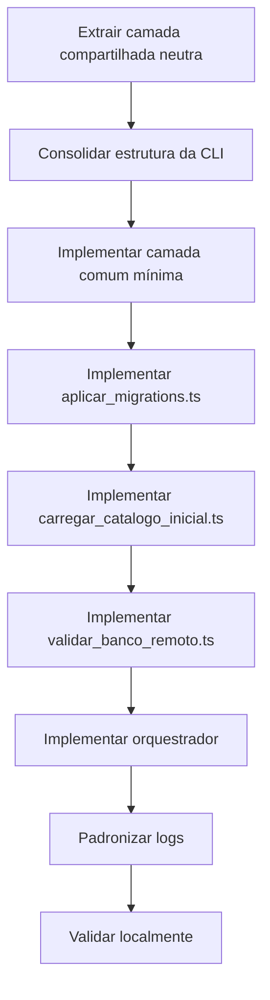

# Walkthrough Complementar - Execução Assistida da Validação Remota em Node/JS CLI

> **Última atualização:** 2026-03-09
> **Status:** Concluído
> **Tipo:** Pair programming / registro assistido
> **Origem:** Derivado de `validacao_migrations_carga_remota.md`

---

## 1. Objetivo

Registrar a ordem prática usada durante a implementação assistida da trilha de validação remota, preservando as decisões tomadas em pair programming.

---

## 2. Ordem Aplicada

---

## 3. Decisões Registradas

- a nova trilha permaneceu em **Node/JS CLI**
- o uso de endpoints HTTP para operar banco foi descartado
- o orquestrador ficou sem reset implícito
- `ambiente` foi consolidado em `infra/ambiente/`
- `migrations` e dataset ficaram em `lib/database/`
- os pontos de entrada executáveis ficaram em `lib/scripts/database/`

---

## 4. Evidências da Execução

Ao final da implementação assistida, o projeto passou a ter:

- `infra/ambiente/` consolidado
- `lib/database/banco.ts` reutilizando a camada compartilhada
- `lib/scripts/database/aplicar_migrations.ts`
- `lib/scripts/database/carregar_catalogo_inicial.ts`
- `lib/scripts/database/validar_banco_remoto.ts`
- `lib/scripts/database/orquestrar_validacao_remota.ts`

Também foi validado localmente que:

- cada etapa roda de forma independente
- o orquestrador encadeia as etapas corretamente
- a saída operacional ficou legível e auditável

---

## 5. Referências

- [validacao_migrations_carga_remota.md](./validacao_migrations_carga_remota.md)
- [plano_implementacao_postgres_producao.md](../feat/plano_implementacao_postgres_producao.md)
- [roadmap_supabase_prontidao_producao.md](../roadmap_supabase_prontidao_producao.md)
